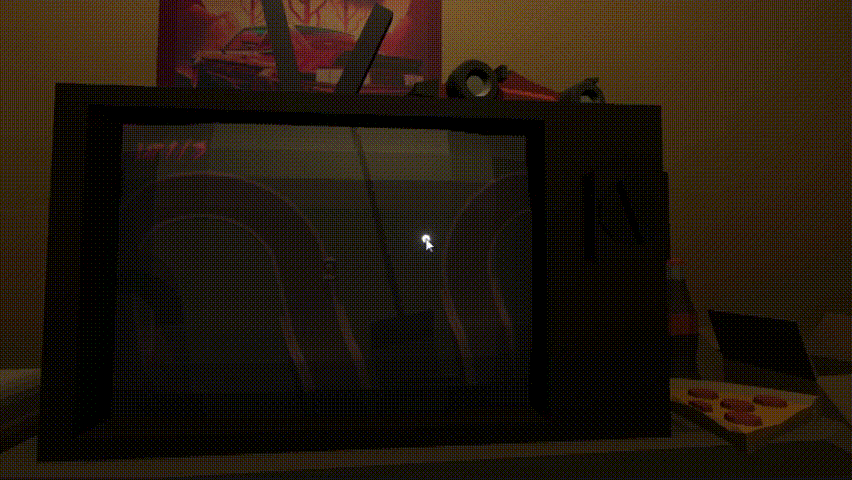
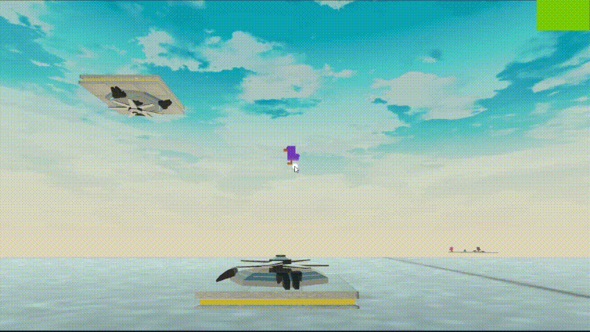
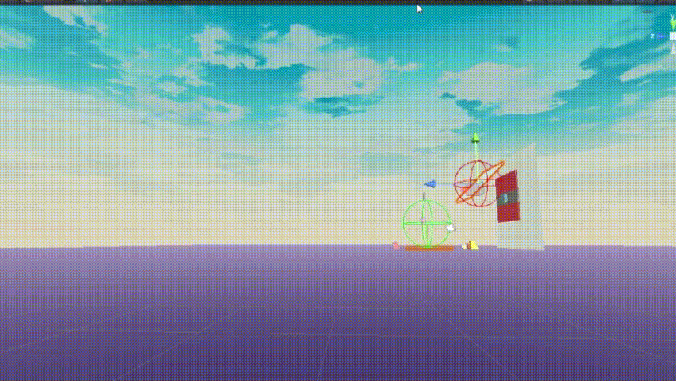
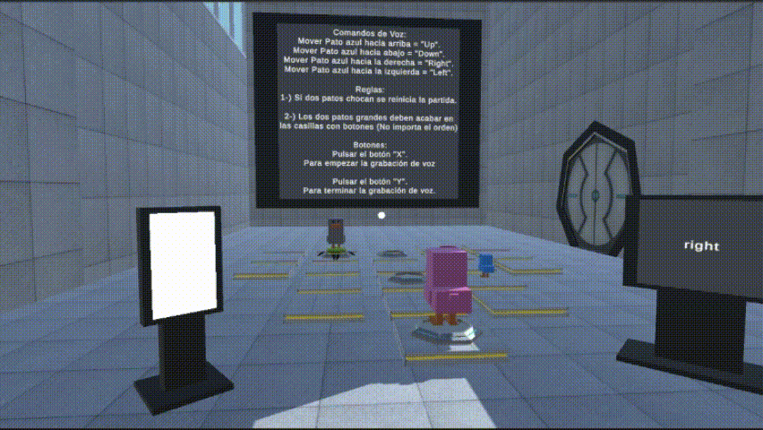
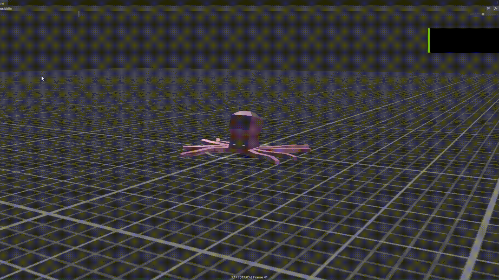

# II-proyecto-final-Aether-Worlds
## Autores
 - Raimon Mejías Hernández(alu0101390161@ull.edu.es).
 - Jorge Gonzales Delgado(alu0101330105@ull.edu.es).
 - Saúl Sosa Díaz (alu0101404141@ull.edu.es).

### Cuestiones importantes para el uso del programa 

#### Controles de mando
El programa esta diseñado teniendo en cuenta el uso de un mando conectado por bluetooth, el movimiento y las acciones del usuario estan enteramente ligadas al uso del mando a excepción de la reticula del google cardboard.
Si se dispone de un mando para poder probar el apk a continuación se listan los controles usados:

- Joystick izquierdo: Utilizado para mover al jugador o al coche dependiendo de la escena. 
- Gatillo izquierdo: Marcha atras del coche en la escena vaporwave.
- Gatillo derecho: Acelerar el coche en la escena vaporwave.
- Botón A: Entrar en las diferentes zonas al mirar los portales | Interactuar y lanzar los patos de goma.
- Botón B: Soltar a los patos de goma.
- Botón X: Activar el microfono.
- Botón Y: Desactivar el microfono. 

#### Paquetes a instalar en caso de modificar el proyecto
Pese a que la exportación del proyecto presenta casi toda las dependencias a necesitar. Algunos assets utilizados no se guardan en el paquete exportado:

- Paquetes importados por Git URL
  - Google Cardboard
  - Hugging Face

- Paquetes propios de Unity
  - PostProcessing
  - CinemaMachine

### Hitos de programación relacionados con los contenidos impartidos 

#### Postprocesado

Se han añadido con el fin de recrear el efecto característico de los ochenta. Consiste en capas de postprocesado que le dicen a la cámara si debe renderizar los postprocesados y volúmenes que dicen que efectos y en donde debe la cámara mostrar. En nuestro caso las cámaras del circuito se encuentran dentro de un volumen que le da a las cámaras unos efectos diferentes a los que tiene la cámara del jugador que se encuentra dentro de otro volumen distinto. Por desgracia en la versión del móvil, múltiples cámaras y efectos de post procesado, realentizan notablemente la tasa de fotogramas.

#### Modelado 3D
La mayoría de los modelos 3D los hemos realizado nosotros. Consumiendo gran cantidad de tutoriales de blender, hemos aprendido mucho sobre este tema.

#### Audio y doblaje

Utilizando varios componentes AudioSource y el AudioListener se pueden gestionar de manera secuencial para la realización de dialogos. 
En la Zona pirata se han utilizado varias boxCollider para representar un dialogo con la calavera

#### Simulación de físicas
Para probar los conceptos acerca de física se ha ideado la creación de patos de goma que reboten y le afecte el viento.

Se ha programado el script DuckBehaviour para realizar la interacción jugador con los patos de goma. 
El jugador es capaz de tomar el pato utilizando el botón A al mirarlo. 
Volver a pulsar el botón A lanzará al pato en la dirección de la cámara.
Si se tiene al pato y se presiona el Botón B se soltará al pato sin ninguna fuerza adicional.

Adicionalmente a la física de los patos, se ha creado un script FanController que añade una fuerza, simulado viento, a los patos.
permitiendo elevar o mover a los patos en la dirección a la que observe el ventilador. Esto se consigue gracias a Raycast esfericos.

#### Reconocimiento de voz, utilización de microfono y eventos.

Aprovechando la API de reconocimiento de voz explicado en las sesiones de práctica se ha ideado un minijuego que utilice la voz del jugador para realizar acciones.
Se han creado los scripts VoiceMinigame, DuckVoiceResponse y SpeechRecognition.

El script SpeechRecognition recibe el input de activación del microfono y la voz del jugador y activa el Evento MoveDuck.
El script VoiceMinigame genera y controla la ejecución del minijuego.
El script DuckVoiceResponse se mantiene a la escucha del evento MoveDuck y cambia la posición de los patos dentro del tablero.

#### Utilización de sensor: Giroscopio.

Utilizando los sensores del movil se puede aprovechar el giroscopio para obtener la velocidad ángular del jugador y así comprobar si se esta moviendo el movil.
Unido a la utilización de las google Cardboard se puede simular el efecto de mover la cabeza dentro del juego.

#### Realización de animaciones

Hemos dado un paso emocionante en nuestro proyecto, utilizando Blender para dar vida a nuestras creaciones. Hemos ido más allá al incorporar 'huesos' a los modelos, un proceso meticuloso que inyecta realismo y dinamismo en cada movimiento. Posteriormente, estas animaciones cobran vida en Unity, donde utilizamos el Animator Controller para pulir y perfeccionar cada detalle. Esta integración de tecnologías no solo mejora significativamente la experiencia del usuario, sino que también sumerge a los espectadores en un mundo virtual más creíble y cautivador.

### Ejecución del juego

[Enlace](https://youtu.be/wG3P28m93ns?si=UoD1iny3nqNgyqLk)

### Aspectos a destacar 

#### Creación de modelados propios y problemas de Ejes 
Nos enfrentamos a un desafío considerable en la fase de exportación de nuestros modelos desde Blender. Los ejes, esos fundamentos invisibles pero cruciales, se resistían a alinearse correctamente al ser importados en Unity, creando un rompecabezas frustrante. Además, el inesperado gimball lock se convirtió en un obstáculo recurrente, entorpeciendo la fluidez de nuestras animaciones y poniendo a prueba nuestra paciencia y habilidades técnicas.

### Reparto del trabajo

La idea general para la elaboración de este proyecto es la realización del trabajo separado en varias escenas creadas cada uno por un integrante. Aún así, a la hora de ensamblar las escenas tuvimos que involucrarnos todos los integrantes con todo el proyecto. 
Por tanto se ha llevado a cabo la siguiente distribución:

#### Tareas realizadas en conjunto:
##### Creación de una escena central
El proyecto cuenta con un escenario central donde poder escoger una de las tres posibles zonas. Para representar los contenidos de cada una de las zonas jugables se ha tomado la decisión de crear pequeñas islas alrededor del espacio central que ilustren el estilo y minijuegos que se encuentran dentro. La creación de las islas se desglosa de la siguiente manera:
- Modelo de la isla central: Saúl Sosa diaz.
- Modelo de la isla con tematica vaporwave: Saúl Sosa diaz.
  - Decoración de la isla: Jorge Gonzales Delgado.
- Modelo de la isla con tematica cientifica: Saúl Sosa diaz.
  - Decoración de la isla: Raimon Mejías Hernández.
- Modelo de la isla con tematica pirata: Saúl Sosa diaz.
  - Decoración de la isla: Saúl Sosa diaz.
- Creación de scripts para la escena: Saúl Sosa diaz, Raimon Mejías Hernández y Jorge Gonzales Delgado.

#### Tareas realizadas por separado
Además de la escena central se han creado 3 escenas adicionales, cada zona del juego ha sido creado por uno de los integrantes.

- Isla Vaporwave: Jorge Gonzales Delgado.
- Isla Cientifica: Raimon Mejías Hernández.
- Isla Pirata: Saúl Sosa Diaz. 

#### Agradecimientos
Muchas gracias a Manuel Hernández Pérez, actor de doblaje profesional, por su actuación como la calavera flotante en la isla pirata. 

